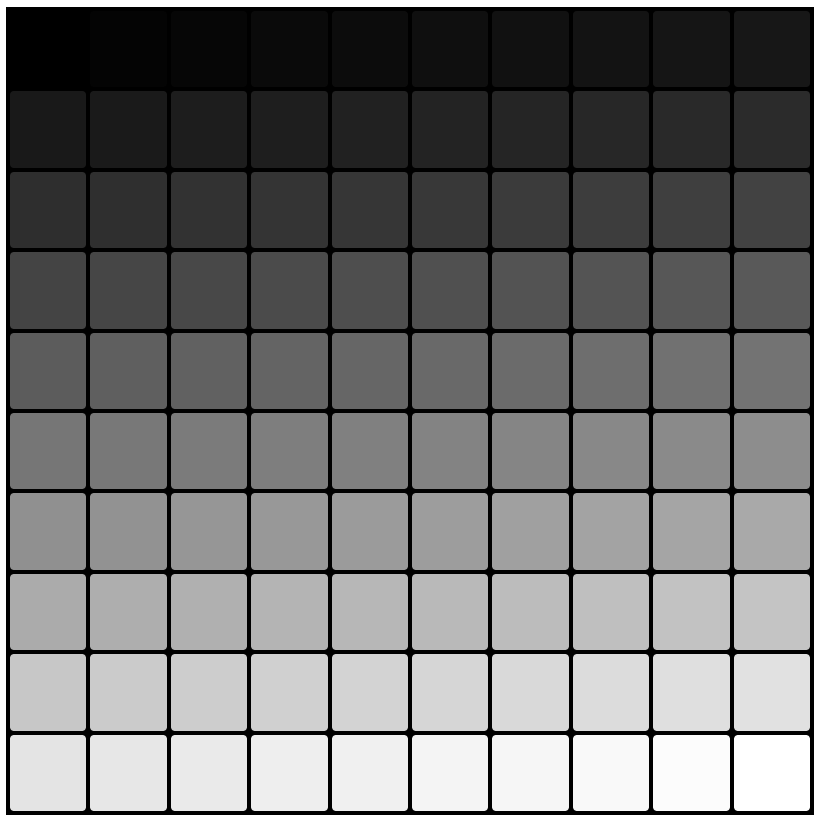

# pixval
visualize gridular type values

## interface
```
namespace pixval {
struct canvas {
    using properties_type = std::map<std::string, std::string>;

    canvas(unsigned columns, unsigned rows, std::string name);

    properties_type& canvas_properties();
    properties_type canvas_properties() const;
    properties_type& pixel_properties();
    properties_type pixel_properties() const;

    void set_pixel_value(float, unsigned x, unsigned y);
    void set_pixel_values(float *);
    std::string make_css() const;
    std::string make_html() const;
private:
    // ..
};
}
```

## Build
see `test/build_and_run`

## Example
see `test/example.cpp`

## Result
see 

## Dependencies
- clone [text_utils](https://github.com/mucbuc/text_utils.git) into lib folder (see test folder)
